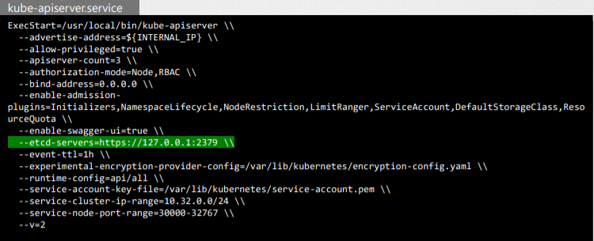
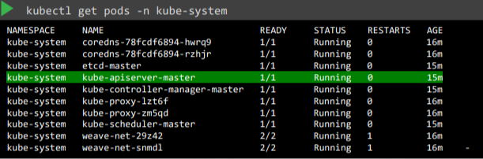
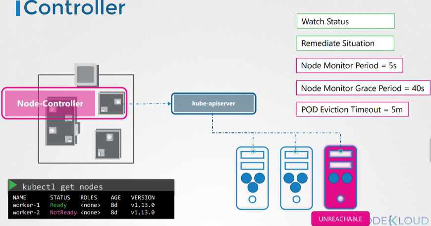
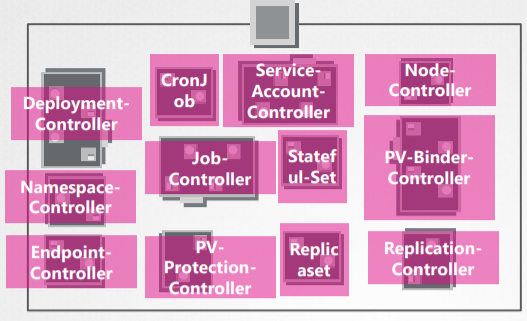
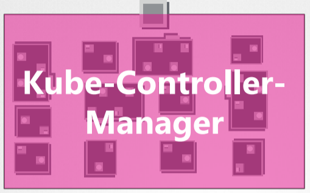

# Kubernetes 필기
<h2> Kubernets </h2>

목적 : 자동화된 방식으로 컨테이너 형태로 애플리케이션을 호스팅하는 것.   

-> 애플리케이션 내의 서로 다른 서비스 간에 필요한 만큼의 애플리케이션 인스턴스를 쉽게 배포하고 통신을 쉽게 활성화할 수 있다.

<br>
<br>

> <h2> Cluster Architecture </h2>


쿠버네티스의 전체적인 구조는 Master Node와 Worker Node로 나뉘어 진다.   

- ETCD Cluster : 키-값 형식으로 정보를 저장하는 데이터베이스.   
클러스터에 관한 정보를 저장하는 곳.
- Kube-scheduler : 애플리케이션, 노드의 컨테이너들을 스케쥴링하는 역할. 컨테이너의 자원량, 워커 노드의 상태, taint&toleration 등을 고려하여 어떤 노드에 컨테이너를 배치할지 "결정" 한다.
- Kube-api Server : Worekr Node의 클러스터 내에서 벌어지는 모든 일들을 총괄, 관리한다.
- Kube Controller Manager : 다양한 분야를 컨트롤 한다. Node Controller, Replication Controller 등 다양하다.

<br>
<br>

> <h2> ETCD </h2>

<b> Etcd </b> : 간단하고 안전하며 빠르고 분산된 안정적인 키-값 저장소


`Put Name 'John Doe'`   -> 키와 값을 넣고 데이터베이스에 저장   
`Get Name`              -> 키를 통해 값을 가져올 수 있다.

※ 키와 값은 중복될 수 없다 ※

1. 일반적으로 사용하는 데이터베이스를 대체하지는 않지만, 대신 빠른 읽기 및 쓰기가 필요한 구성 데이터 등 작은 데이터 청크를 저장 및 검색하는 데 사용됨.

2. 클러스터에 관한 정보를 저장한다. -> Nodes, PODs, configs, Secrets, Accounts, Roles, binding.. 

<br>
<br>

<b> Install ETCD </b>


<br>
<br>

<b> Operate ETCD </b>   


./etclctl set key1 value1 명령을 통해 키-값을 저장할 수 있고, get 명령어로 가져올 수 있다.

ETCD를 실행하면, 2379 포트(default)를 통한 서비스를 시작한다.   
You can attach any clients to the ETCD service to store and retrieve information.
default 클라이언트는 etcdctl 클라이언트이다. ⇒ command line client

<br>
<br>

<b>ETCD의 역할</b> 

- kubectl get 명령을 실행할 때 표시되는 모든 정보는 ETCD 서버에서 가져오는 것임.
- 노드 추가, 포드 또는 복제 세트 배포 등 클러스터에 대한 모든 변경 사항은 ETCD 서버에서 업데이트 됨.
- 변경이 완료된 것으로 간주되는 것은 ETCD 서버에서 업데이트가 완료된 경우 뿐임

<br>
<br>

Cluster를 설정하는 방법에 따라 ETCD는 두 가지 유형으로 배포하게 된다.

1. ETCD 바이너리를 직접 다운로드 및 설치 후 마스터 노드에 ETCD를 서비스로 구성하는 방법


etcd.service -> etcd를 클러스터로 구성한 것 -- 옵션 살펴보기.   
위 사진에 표시된 줄을 살펴 보면 위 주소(URL)는 ETCD 서버에 닿기 위해 API-Server에 명시되어 있어야 한다.   
(2379(default)는 etcd가 수신하는 포트이다.)

<br>

2. Kubeadm tool을 이용한 배포  

kubeadm을 사용하여 클러스터를 설정하면 Kube-system 네임스페이스에 POD로 ETCD 서버가 배치됩니다.


POD 내의 etcdctl을 사용하여 ETCD 데이터베이스를 탐색할 수 있는데, kubernetes에 저장된 모든 키를 나열하려면 다음과 같이 etcdctl get 명령을 실행하면 됨.

<br>
<br>

<h2>ETCD in HA Environment</h2>

고가용상 환경에서는 클러스터 내에 여러 마스터 노드가 있고, 마스터 노드에 여러 ETCD 인스턴스가 분산된다.   
이 경우 ETCD 서비스 Configuration에서 올바른 파라미터를 설정하여 ETCD 인스턴스가 서로 알고 잇는지 확인해야 한다.


initial-cluster 옵션은 ETCD 서비스의 다른 인스턴스를 지정해야 한다.

<br>
<br>

> <h2> Kube-API Server </h2>


- kubectl 명령을 실행하면 kubectl utlity가 실제로 kube-api server에 도달한다.
- kube-api 서버는 먼저 요청을 인증하고 유효성을 검증한다.
- 그런 다음 ETCD 클러스터에서 데이터를 가져와 요청된 정보로 응답한다.

실제로 kubectl 명령을 사용하는 대신 이와 같이 게시 요청을 전송하여 API를 호출할 수도 있다.

<br>
<br>
<b> POD 생성의 Example </b>

1. authenticate the request and validate it.    
그리고 나서 ETCD 서버로부터 데이터를 검색해 (Retrieve) 요청된 정보를 응답함.   
(이때, kubectl 명령어를 쓰지 않고 직접적으로 API를 이용해 POST request를 보내도 됨)

2. API 서버는 일단 POD를 생성하는데 이를 Node에 배정한지는 않음. 대신 POD 생성 정보를 ETCD 서버에서 업데이트(Update)하고 유저에게도 업데이트함.

3. scheduler로 계속 API 서버 모니터링하다가 Node에 배정이 되지 않은 POD를 발견함. 해당 POD를 배치할 적절한 Node를 선택해 API 서버에 알림.

4. API 서버는 ETCD 서버를 또 없데이트하고 해당 Worker Node의 kubelet에 정보를 전달한다.

5. 정보를 전달받은 kubelet인 Node에 POD를 생성하고, 컨테이너 런타임 엔진(예를 들어 도커)에게 애플리케이션 이미지를 배포하라고 지시함.

6. kubelet이 API 서버에 상태 변경을 보고하고, API 서버는 ETCD 클러스터를 업데이트한다.

즉, 요약하면 순서는

   
<br>- kube-api server는 etcd datastore와 직접적으로 소통하는 유일한 컴포넌트다.    

<br>
<br>
Kube api-server에는 여러 옵션들이 있고, 하이퍼 마라미터(?)도 굉장히 많다. 이는 hardway 공부할 때 주로 다루며, 해당 부분을 공부하면 쿠버네티스를 깊게 이해할 수 있다.

<br>
<br>

<b>Install Kube-api server
</b>

“ wget https://storage.googleapis.com/kubernetes-release/release/v1.13.0/bin/linux/amd64/kube-apiserver”  



(kube-api 서버가 etcd 서버에 연결하는 방법
<br>
<br>



kube-api 서버를 kube-api 서버의 pod로 배포하기 때문에 Master Node의 시스템 네임스페이스에 있는 pod 정의 파일 내에서 확인할 수 있음

    cat /etc/kubernetes/manifests/kube-apiserver.yaml
    cat /etc/systemd/system/kube-apiserver.service  # api-server에 관한 정보들을 볼 수 있음

> <h2> Controllers </h2>

<br>
<b> 역할 </b>

1. 상태 모니터링
2. 상황 복구

<br>

<b>k8s에서 Controller 정의 : </b> 

시스템 내의 다양한 컴포넌트의 상태를 지속적으로 감시하고 시스템 전체를 원하는 기능 상태로 만들기 위해 작동하는 프로세스



Example ) Node Contoller는 노드 상태를 모니터링하고 애플리케이션을 계속 실행하기 위해 필요한 작업을 수행한다.   
(이 작업은 kube-api 서버를 통해 이루어진다. )    
Node Controller는 5초마다 Node 상태를 확인하는데, Node로부터 수신이 정지된 경우,   
Node는 Unreachable으로 mark되지만 완전히 Unreachable이 되기까지 40초간 기다리게 된다.   
즉, 문제 있는 노드라 판단하기 위해 40초 기다림. 40초 후에도 비정상이면 Unreachable 이라고 마킹함.   
give 5 minutes to come back up. 그 후에도 문제가 있다면  해당 노드에 있는 파드를 제거하고 잘 작동하는 노드에 provision 한다. (If the pods are part of the replica set)

<br>
<br>

<b>Replication Controller</b>

- Replica sets의 상태를 모니터링하여 항상 POD들이 적당량으로 존재할 수 있게 보장한다.
- POD가 죽으면 새로 생성



다양한 컨트롤러를 하나의 패키지로 Kube-Controller-Manager로 칭한다.



<b>Install Kube-Controller-Manager</b>


Node Monitor Period와 Node Monitor Grade Period와 같은 옵션들도 여기에 다 있음.


컨트롤러를 notable로 지정하기 위한 추가 옵션도 있음.
Default로 모두 유효하게 되어 있지만, 작동하지 않거나 존재하지 않는 경우 일부만 활성화 가능.

<b>Kube-controller-manager 서버 옵션 보기</b>


    cat /etc/kubernetes/manifests/kube-controller-manager.yaml
    cat /etc/systemd/system/kube-controller-manager.service
    ps -aux | grep kube-controller-manager

> <h2>Kube Scheduler</h2>

<br>

어떤 파드를 어떤 노드에 놓을지를 “결정”하는 역할을 한다는 점 기억해두기.
즉, 실제로 파드를 노드에 두는 행위를 수행하는 것이 아니라, 결정만 한다는 점. 실제 행위는 kubelet이 한다. 

POD에 가장 적합한 Node를 식별하기 위한 두 단계

1. Filter Nodes
Pod의 요구사항에 맞지 않는 것들은 다 거른다.

2. Rank Nodes
Scheduler는 Pod를 배치 후 Node에서 사용 가능한 리소스의 양을 계산하고 가장 최적의 Node를 식별한다.

이외에도.. Resource Requirements / Limits, Taints and Tolerations, Node Selectors / Affinity


위 사항들을 고려해서 스케줄링 해야한다.
-> 관리자가 자신만의 Scheduler를 작성할 수도 있다.

<br>

<b>Install Kube Scheduler</b>

<br>


<br>

    cat /etc/kubernetes/manifests/kube-scheduler.yaml
    ps -aux | grep kube-scheduler

<br>

> <h2>Kubelet</h2>

<br>
비유하자면, 워커 노드라는 배의 선장 역할을 한다고 보면 된다.
<br>
- Master Node와 유일한 연결 지점.

<br>

1. Pod와 그 안의 컨테이너 상태에 대한 보고서를 정기적으로 보냄.

2. Worker Node의 kubelet은 Kubernetes 클러스터에 Node를 등록 후 Node에 컨터이너 또는 Pod를 로드하라는 지시를 받으면 컨테이너 런타임을 요청한다.
3. Docker와 같은 컨테이너 엔진을 사용하여 필요한 Image를 가져오고 Instance를 실행함.
4. Kubelet은 Pod와 그 안의 컨테이너 상태를 게속 모니터링 하고 Kube-api에 정기적으로 보고함.

<b>Install Kubelet</b>

<br>


Kubelet은 다른 컴포넌트들과 달리 Kubeadm Tool을 이용해서 자동으로 배포되지 않기 때문에 수동으로 Kubelet을 설치해야 한다.

    ps -aux | grep kubelet

<br>

> <h2>Kube-Proxy</h2>

<br>

클러스터 모든 Pod는 다른 모든 Pod에 연결할 수 있는데, 이 작업은 Pod 네트워킹 솔루션을 클러스터에 배포하여 수행할 수 있다.

Pod 네트워크는 모든 Pod가 연결되는 클러스터의 모든 노드에 걸쳐 있는 내부 가상 네트워크다. 이 네트워크를 통해 서로 통신할 수 있다.


첫 번째 노드에 웹 애플리케이션(파란색)을 배포하고, 두 번째 노드에 데이터베이스 애플리케이션(초록색)을 배포했다고 하자.

: 웹 애플리케이션은 데이터베이스 파드의 IP주소를 이용해 간단히 닿을 수 있다.   
: 그러나 DB 파드의 IP 주소가 항상 같다는 보장이 없다. (Pod의 IP주소는 동적임)   
: 따라서, 웹 파드가 데이터베이스 파드에 접근하는 가장 좋은 방법은 바로 Service이다.   
: 서비스는 IP 주소를 할당받을 수 있다.

-> 웹 파드가 Service의 IP주소&서비스명을 이용해 Service에 접촉하면, Service가 db 파드(backend pod)에 트래픽을 전달해준다.    
즉, 웹 파드는 데이터베이스 파드와 소통 가능해진다.

Service는 실제로 존재하는 것이 아니기 때문에 (쿠버네티스 메모리에만 존재하는 가상 컴포넌트) Service는 POD network에 속할 수 없다.   
즉, 서비스는 파드처럼 컨테이너가 아니다. 따라서 인터페이스 같은 것도 존재하지 않는다. 

서비스는 클러스터에 존재하는 모든 노드가 접근 가능해야 하는데, 이는 어떻게 이루어지는 것인가?

Kube-Proxy는 쿠버네티스 클러스터 내의 각 노드에서 작동하는 프로세스이며, 위 역할을 수행한다.   
그리고 새로운 서비스들을 찾는 것이 바로 kube-proxy의 역할이기 때문이다.

위 사진에서 IP Tables를 확인해보면, 앞에는 Service의 IP가 있고 뒤에는 트래픽 전송 목적지인 DB의 IP가 있음을 알 수 있다.

<br>

<b>Install Kube-Proxy</b>

<br>


kubeadm 툴은 kube-proxy를 각 노드에 파드로 배포한다. 


실제로, kube-proxy는 daemonset으로 배포된다. So a single POD is always deployed on each node in the cluster.
(daemon set는 아직 안배웠음 ) 

<br>

## Recap - PDS

<br>

K8S의 Worker node는 직접 컨테이너를 배포하지 않느다.
   
컨테이너는 'POD'FKSMS K8S 오브젝트 안에 캡슐처럼 감싸져 있고, POD는 애플리케이션의 한 인스턴스이며, K8S에서 만들 수 있는 가장 작은 오브젝트이다.

<b>Q1. 애플리케이션에 액세스하는 사용자 수가 증가하고 애플리케이션을 확장해야 하는 경우 트래픽을 분산시키려면 웹 애플리케이션의 인스턴스를 추가해야 하는데, 어떤 방식으로 추가할까?</b>   

<br>

A1.   
동일한 애플리케이션의 동일한 POD에 새 인스턴스를 추가하기. --- (X)   
동일한 애플리케이션의 새로운 POD에 새 인스턴스를 추가하기. --- (O)   

<br>

<b>Q2. 사용자 기반이 더 증가하고 현재 Node에 충분한 요량이 없으면 어떻게 할까?</b>

<br>

A2. 언제든지 새 Node에 추가 POD를 배포할 수 있다.

<b> 즉, 결론은 POD는 일반적으로 애플리케이션을 운영하는 컨테이너들과 일대일 관계를 가진다. </b>

To scale up, create new pods. To scale down, delete existing pods.
애플리케이션의 스케일을 키우기 위해 이미 존재하는 파드에 추가적으로 컨테이너를 추가해서
는 안된다.   

<br>

## Multy-Container PODs

<br>

한 개의 POD에 여라 개의 컨테이너가 있을 수 있다. 단, 컨테이너의 종류는 달라야 한다.

> Example 

   

Hepler-Container를 애플리케이션 Container와 함께 사용할 수 있다. (둘의 성격이 다름)   
(Helper Container : 사용자 처리, 데이터 입력, 사용자가 업로드한 파일 처리 등 웹 응용 프로그램에 대한 지원 작업을 수행하는 Container)   

예시와 같은 상황이라면 동일한 POD에 Container를 포함시킬 수 있고, 애플리케이션 Container가 생성되면 Helper Container도 같이 생성되고, 삭제되면 같이 삭제된다.

두 개의 컨테이너는 동일한 POD 안에 속해 있기 때문에 localhost를 참조해 서로 직접 통신할 수도 있고, 저장 공간도 쉽게 공유할 수 있다.

Docker 호스트에 애플리케이션을 배포하기 위한 프로세스 또는 스크립트를 개발중이라고 가정.   
그런 다음 Python 애플리케이션을 배포하면 정상적으로 실행되어 사용자가 액세스할 수 있다. 부하가 증가하면 명령을 여러 번 실행하여 Python 애플리케이션 인스턴스를 더 많이 도입한다.

```
# docker run python-app
# docker run python-app
# docker run helper –link app1
# docker run helper –link app2 # 도우미 컨테이너는 애플리케이션 컨테이너와 1대1 관계를 유지하므로 애플리케이션 개수와 같이 생성
```
=> 이때, 우리는 두 컨테이너를 연결 짓는 map을 유지해야 한다.   
즉, link와 custom network를 이용해 네트워크 연결성 (network connectivity)를 설치한다.   
=> 이에 따라 또 공유 가능한 Volumes, 공유된 것들, 또 이를 위한 map이 필요하다.   
=> 또, 애플리케이션의 상태를 모니터링해야 할 필요가 있다.   

이러한 것들을 쿠버네티스는 자동으로 처리해준다.

<b> ※ Multi Pod Container는 드문 사용 사례임 ※ </b>

<br>

### POD Deploy

<br>

```
# kubectl run nginx --image nginx       # DockerHub에서 이미지를 가져와서 POD 배포
# kubectl get pods                      # 확인.
```
이미지는 DockerHub에서 다운로드 한다.

-> 아직은 네트워크 서비스가 이루어지지 않음.

YAML in Kubernetes
```yaml
pod-definition.yaml
---
apiVersion: v1                      # string
kind: Pod                           # string
metadata:                           # 사전형
    name: myapp-pod                 # string
    labels:                         # 사전형
        app: myapp  
        tier: front-end
spec:
    containers:                     # List/Array
        - name: nginx-container     # '-'은 첫 번째 항목임을 나타낸다.
          image: nginx
---
# kubectl apply -f pod-definition.yaml
# kubectl get pods
# kubectl describe pod myapp-pod
```

몇 가지 예시
|Kind|apiVersion|
|----|----------|
|Pod|v1|
|Service|v1|
|Deployment|apps/v1|
|ReplicaSet|apps/v1|
apiVersion, kind, metadata, spec은 필수 요소   
metadata : 해당 오브젝트에 관한 데이터를 가지고 있다.   
metadata의 이름과 라벨 앞에 공백 수는 중요하지 않지만, 같은 선상에 있어야 한다.   
선상이 같지 않으면 하위 항목이 된다.

<br>

## Recap - ReplicaSets

<br>

Controller Manager는 쿠버네티스 오브젝트들을 모니터링하고 그에 맞는 행동을 취해준다.   
여기서는 많은 컨트롤러 중 replication controller에 대해 살펴보자.   

<b>Q. Replica는 무엇이며 Replication Controller는 왜 필요할까?</b>

Hint - If ) 애플리케이션을 실행하는 단일 POD가 있는데, 어떠한 이유로 애플리케이션이 충돌하고 POD가 Fail이 된다면??   
-> 사용자가 애플리케이션에 액세스 할 수 없게 되어, 애플리케이션을 사용할 수 없다.   

<A. 여러 인스턴스 또는 POD를 동시에 실행을 하면 1개에 장애가 발생해도 애플리케이션은 계속 실행된다. Replication Controller는 이 싱글 POD를 여러 개 운영하는 데 도움을 줌으로써 <b>고가용성</b>을 제공한다.   

Replication Controller를 사용하는 또 다른 이유는 <b>Load Balancing</b> 과 <b>Scaling</b> 때문이다.   

Replication Controller는 여러 POD 운영을 통해 Load를 공유 가능하게 한다.   
앞서 말했듯, 사용자의 접근량은 계속 늘어나는 와중에 노드의 자원이 부족해지면, 클러스터 내 다른 노드에 POD를 추가적으로 배포한다. 그리고 Replication Controller가 클러스터에서 그 노드들 모두에 걸처져 있다고 보면된다.

   
즉, 이처럼 여러 노드에 파드를 생성함으로써 트랙픽을 나눔으로써 로드밸런싱을 가능하게 하고, 수요가 늘 때 애플리케이션의 크기를 늘릴 수 있다.

<br>

<b> ReplicaSets 이점 </b>
***
\- 고가용성   
\- Load Balancing   
\- Scaling

<h3> Replication Controller & Replica Set  </h3>

***
위 두 가지는 같은 목적을 가지고 있지만, 같은 것은 아니다.   
Replication Controller은 후자보다 오래된 기술이고 Replica Set으로 대체되고 있다.   
Replica Set이 더 권장되는 추세.   

지금까지 위에서 배운 것들은 두 기술 모두에 해당되는 내용이다.

<br>

## Deployments

<br>

IF ) Production 환경에 배포해야 하는 웹 서버가 있다.   
\- 하나가 아닌 여러 개의 Instance를 운영하기를 원함.   
\- Docker 레지스트리에서 최신 버전이 나올 때마다 Docker Instancd를 원활하게 업그레이드를 하고 싶음

But ) Instancd를 업그레이드를 할 대 모든 Instance를 한 번에 하고 싶지는 않고 사용중인 User가 있을 수 있기 때문에 순차적으로 진행하고 싶음.

> 이러한 업그레이드를 <b>Rolling Upgrade</b>라고 한다.

<br>

IF ) Rolling Upgrade를 사용을 하게 되면
업그레이드를 진행했을 때 예기치 않은 오류가 발생하여 실행 취소 메시지가 표시가 되는 상황이 있더라도

-> 최근에 수행된 변경사항으로 롤백할 수 있음.

***
그 외 이점
***
기본 Web Server 버전 업그레이드, 환경 확장 및 리소스 할당 변경 등 환경을 여러 번 변경할 수 있음.

위 사항들을 K8S Deployment가 있기에 가능하다.

<br>

   
컨테이너는 POD에 캡슐화되어 있으며, 이러한 POD는 Replication Controllers 또는 Replica Set를 사용하여 배포된다.

( Deployment는 ReplicaSet의 상위 객체 )

> <b> 결론 </b>

Deployment는 Rolling 업데이트를 사용하여 기본 Instancd를 원할하게 업그레이드하고, 변경 내용을 실행 취소하며, 필요에 따라 변경 내용을 일시 중지 및 재개할 수 있다.

<br>

### Create Deployment

<br>

전반적으로 ReplicaSet의 YAML 형태와 유사하다.
``` yaml
deployment-definition.yml
--- 
apiVersion: apps/v1
kind: Deployment
metadata:
  name: myapp-deployment
  labels:
    app: myapp
    type: front-end
spec:
  template:
    metadata:
      name: myapp-pod
      labels:
         app: myapp
         type: front-end
    spec:
      containers:
      - name: nginx-container
        image: nginx

  replicas: 3
  selector:
    matchLabels:
	type: front-end
```
```
kubectl create –f deployment-definition.yaml
kubectl get deployments
kubectl get replicaset
kubectl get pods
```
> output
```
NAME               READY   UP-TO-DATE   AVAILABLE   AGE
myapp-deployment   3/3     3            3           2m37s
```
```
NAME                          DESIRED   CURRENT   READY   AGE
myapp-deployment-7df67f74c5   3         3         3       2m26s
```
```
NAME                                READY   STATUS    RESTARTS   AGE
myapp-deployment-7df67f74c5-c7nqt   1/1     Running   0          2m13s
myapp-deployment-7df67f74c5-lms6d   1/1     Running   0          2m13s
myapp-deployment-7df67f74c5-spxpb   1/1     Running   0          2m13s
```
